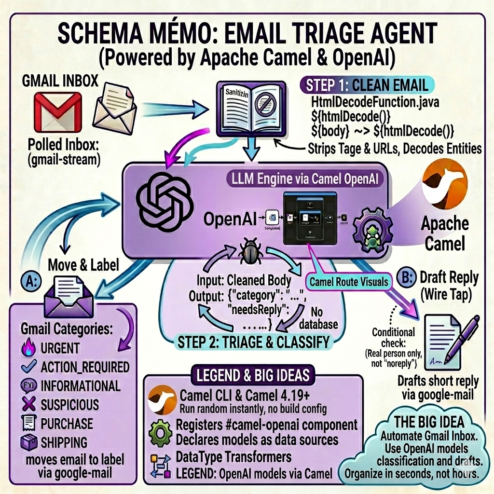
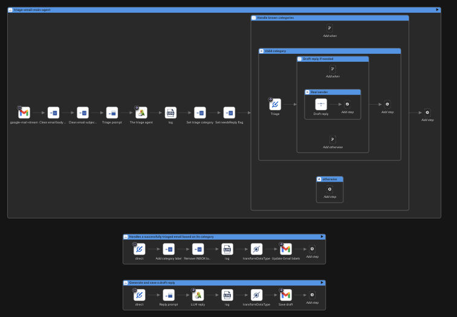

# Email Triage Agent

A personal AI agent that reads your Gmail inbox, classifies emails into categories (urgent, informational, purchase, shipping, etc.), summarizes their content, and automatically moves them to the corresponding Gmail label.


*Generated by Nano Banana*

> **Want to use a local LLM instead of OpenAI?** See the [LangChain4j + Ollama variant](local-llm/README.md).

## What It Does

The agent polls your Gmail inbox for unread emails, sends each one to OpenAI for classification, and moves the email to a matching Gmail label based on the result.

Categories:
- **URGENT**: Requires immediate action (deadlines, incidents, escalations)
- **ACTION_REQUIRED**: Needs a response but is not time-sensitive
- **INFORMATIONAL**: FYI, newsletters, automated notifications
- **SUSPICIOUS**: Spam, phishing attempts, unsolicited offers
- **PURCHASE**: Purchase confirmations, invoices, receipts
- **SHIPPING**: Package tracking, delivery notifications

## Camel Components Used

- **camel-openai**: AI-powered email classification and summarization via OpenAI
- **camel-google-mail-stream**: Poll Gmail inbox for unread emails
- **camel-google-mail**: Move emails to labels via the Gmail API
- **camel-jsonpath**: Extract structured fields from LLM JSON responses

## Architecture

- Camel JBang for the runtime
- Kaoto for visual route design
- OpenAI for LLM inference
- No database required: connects directly to Gmail via OAuth2

### Visual Routes in Kaoto



## Project Structure

- **email-triage.camel.yaml**: Main Camel routes:
  - `triage-email-main-agent`: Reads Gmail, cleans the body, sends it to the LLM, extracts the category
  - `handle-triaged-email`: Moves the email to the matching Gmail label
  - `draft-reply`: Generates and saves a draft reply

  The routes use two DataType Transformers from `camel-google-mail`, introduced in Camel 4.19. See [DataType Transformers for Gmail](#datatype-transformers-for-gmail) for details.
- **HtmlDecodeFunction.java**: Custom Camel Simple function `${htmlDecode()}` that sanitizes email content before sending it to the LLM. See [Clean Email Subject and Body](#clean-email-subject-and-body) for details.
- **application.properties**: OpenAI model config + Gmail OAuth2 credentials template
- **local-llm/**: Alternative variant using LangChain4j + Ollama for local LLM inference

## Choosing an OpenAI Model

The default model is `gpt-4.1`. Here is what we observed during testing:

| Model | Triage quality | Notes |
|-------|---------------|-------|
| **gpt-4.1** | Best | Accurate classification, reliable JSON output, good at following structured instructions |
| **gpt-4o** | Acceptable | Slightly less precise on edge cases (e.g. over-classifies some notifications as URGENT) |
| **gpt-4o-mini** | Not suitable | Hallucinates replies, miscategorizes emails, unreliable JSON output |
| **gpt-4.1-mini** | Not suitable | Same issues as gpt-4o-mini |

You can change the model in `application.properties`:

```properties
camel.component.openai.model=gpt-4.1
```

## Prerequisites

### OpenAI API Key

Get an API key from [OpenAI](https://platform.openai.com/api-keys). You can either:
- Set the `OPENAI_API_KEY` environment variable, or
- Fill in `camel.component.openai.apiKey` in `application.properties`

### Camel JBang CLI

Install the [Camel JBang CLI](https://camel.apache.org/manual/camel-jbang.html). This example requires Camel 4.19 or later:

```bash
jbang app install camel@apache/camel
```

## Gmail API Setup

### 1. Create a Google Cloud project

1. Go to the [Google Cloud Console](https://console.cloud.google.com/apis/dashboard)
2. If you don't have a project yet, create one (e.g. `triage-email`)
3. Select the project from the project dropdown

### 2. Configure the OAuth consent screen

1. Go to **APIs & Services** > **OAuth consent screen**
2. Fill in the form if no consent screen is configured yet
3. Go to **Audience** > **Add test users** and add your Gmail address
4. You can publish the application later: test mode is fine for now

### 3. Create OAuth2 credentials

1. Go to **APIs & Services** > **Credentials**
2. Click **Create Credentials** > **OAuth client ID**
3. Select **Web application** as the application type
4. Under **Authorized redirect URIs**, add: `https://developers.google.com/oauthplayground`
5. Click **Create** and save the **Client ID** and **Client Secret**

### 4. Get a Refresh Token

1. Go to the [OAuth 2.0 Playground](https://developers.google.com/oauthplayground/)
2. Click the gear icon (Settings) in the top right corner
3. Check **Use your own OAuth credentials**
4. Enter your **Client ID** and **Client Secret**
5. In the list on the left, select **Gmail API v1** and check `https://mail.google.com/`
6. Click **Authorize APIs** and sign in with your Google account
7. If you see "Google has not verified this application", click **Continue**: this is normal in dev/test mode
8. Confirm the permissions when prompted
9. Click **Exchange authorization code for tokens**
10. Copy the **Refresh Token**

### 5. Enable the Gmail API

On the first run, you may get a `PERMISSION_DENIED` error with a message like:

> Gmail API has not been used in project XYZ before or it is disabled.

Go to the URL provided in the error message and click **Enable** to activate the Gmail API for your project. Wait a few minutes and retry.

### 6. Create Gmail labels

The agent moves triaged emails into Gmail labels based on their category. You need to create these labels manually in your Gmail account:

1. Go to [Gmail](https://mail.google.com/)
2. In the left sidebar, scroll down and click **More** > **Create new label**
3. Create the following labels:
   - `URGENT`
   - `ACTION_REQUIRED`
   - `INFORMATIONAL`
   - `SUSPICIOUS`
   - `PURCHASE`
   - `SHIPPING`

### 7. Configure credentials

Add your OAuth2 credentials to `application.properties` for both the stream consumer and the producer:

```properties
# Consumer (reads inbox)
camel.component.google-mail-stream.clientId=your-client-id
camel.component.google-mail-stream.clientSecret=your-client-secret
camel.component.google-mail-stream.refreshToken=your-refresh-token

# Producer (moves emails to labels)
camel.component.google-mail.clientId=your-client-id
camel.component.google-mail.clientSecret=your-client-secret
camel.component.google-mail.refreshToken=your-refresh-token
```

## Running

```bash
cd email-triage-agent
camel run * --dependency=mvn:org.jsoup:jsoup:1.22.1
```

## Design Notes

### Why You Need to Sanitize Emails Before Sending Them to an LLM

I learned this the hard way. During testing, one email broke everything. The subject contained HTML entities (`&apos;` in "OpenAI&apos;s Privacy Policy"), so the LLM received garbled text. But the real problem was in the body.

The email was full of tracking URLs. Not just short links. Massive URLs, thousands of characters long, with encoded parameters containing readable text. The LLM picked up that text and interpreted it as a second prompt. Instead of returning my nice JSON classification, the agent started responding with things like:

> Do you want me to do anything else with this information, such as summarize it further?

That's **indirect prompt injection**. The URLs injected instructions into the LLM's context, and the model followed them instead of doing its job. This is a known attack vector for LLM-based email processing. See [Weaponizing LLMs: Bypassing Email Security Products via Indirect Prompt Injection](https://www.immersivelabs.com/resources/c7-blog/weaponizing-llms-bypassing-email-security-products-via-indirect-prompt-injection) for a detailed analysis.

The fix: sanitize everything before it reaches the LLM. A custom Camel Simple function `${htmlDecode()}` (`HtmlDecodeFunction.java`) handles this. It uses [Jsoup](https://jsoup.org/) to parse the HTML and extract clean text (strips tags, decodes all entities including `&apos;`, normalizes whitespace), then strips all URLs with a regex. Both subject and body are cleaned by chaining this function with the Simple `~>` operator:

```yaml
- setVariable:
    name: cleanedEmailBody
    simple:
      expression: ${body} ~> ${htmlDecode()}
```

After sanitization, the LLM only sees plain text. No HTML, no URLs, no injected prompts. Problem solved.

### Custom Simple Function

The sanitization logic lives in a plain Java class (`HtmlDecodeFunction.java`) that plugs directly into Camel's Simple language. This is possible thanks to the `SimpleFunction` interface, introduced in Camel 4.18.

The class implements `SimpleFunction`, which requires three things: a function name (`htmlDecode`), whether it accepts null input, and an `apply` method that takes the exchange and the input value, and returns the transformed result. That's it.

```java
@BindToRegistry("html-decode-function")
public class HtmlDecodeFunction implements SimpleFunction {

    @Override
    public String getName() {
        return "htmlDecode";
    }

    @Override
    public Object apply(Exchange exchange, Object input) throws Exception {
        String text = Jsoup.parse(input.toString()).text();
        text = text.replaceAll("\\(\\s*https?://[^)]*\\)|https?://\\S+", "");
        return text.trim();
    }
}
```

`@BindToRegistry` registers the bean in the Camel registry at startup. Once registered, the function is available in any Simple expression as `${htmlDecode()}`. Combined with the `~>` chain operator (also introduced in Camel 4.18), you can pipe data through the function in a single line:

```yaml
simple:
  expression: ${body} ~> ${htmlDecode()}
```

This reads as: take the message body, pass it through `htmlDecode()`, and use the result. No need for a processor bean or a separate route. The transformation stays right where it's used.

### DataType Transformers for Gmail

This project uses two DataType Transformers introduced in Camel 4.19 in the `camel-google-mail` component. They handle all the boilerplate of building Gmail API request objects, so you can just set a few variables and call `transformDataType`.

**`google-mail:update-message-labels`**: moves an email to a Gmail label. Set `addLabels` and `removeLabels` variables, call the transformer, and it builds the `ModifyMessageRequest` for you.

```yaml
- setVariable:
    name: addLabels
    simple: ${variable.triageCategory}
- setVariable:
    name: removeLabels
    constant: INBOX
- transformDataType:
    toType: "google-mail:update-message-labels"
- to:
    uri: google-mail:messages/modify
```

**`google-mail:draft`**: creates a draft reply from the LLM response. The transformer takes the body text and builds the full `Draft` object with the correct `In-Reply-To` and `References` headers.

```yaml
- transformDataType:
    toType: "google-mail:draft"
- to:
    uri: google-mail:drafts/create
```

Without these transformers, you'd need Java code to manually construct `ModifyMessageRequest` and `Draft` objects with the Gmail API. The transformers keep everything in the YAML route.

### LLM Output Format

Some local models (e.g. Gemma3) wrap JSON responses in markdown code fences even when told not to. Adding explicit negative instructions in the prompt ("Do NOT wrap it in \`\`\`json\`\`\` or any markdown") fixed this without needing post-processing.

### Defense in Depth for needsReply

A regex filter acts as a safety net on top of the LLM. Even if the model says `needsReply=true`, the agent won't draft a reply if the sender matches `noreply`, `notifications`, `jira`, `github`, etc.

### Fire-and-Forget for Draft Replies

The main route uses Camel's Wire Tap pattern to move the email to its label immediately and generate the draft reply asynchronously. The inbox gets organized in seconds. The draft appears a few seconds later.
