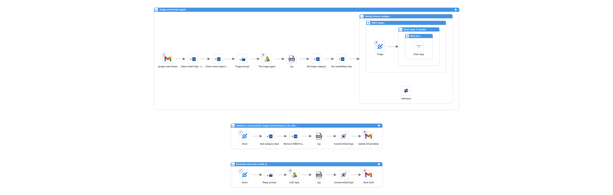

# Email Triage Agent: Local LLM Variant (LangChain4j + Ollama)


*Generated by Nano Banana*

This is the local LLM variant of the [Email Triage Agent](../README.md). It uses **camel-langchain4j-agent** with **Forage** and **Ollama** instead of the OpenAI API.

Everything else is identical: same Gmail setup, same classification logic, same `HtmlDecodeFunction.java`. The only differences are:
- **email-triage.camel.yaml**: uses `langchain4j-agent:triage-agent` instead of `openai:chat-completion`
- **forage-agent-factory.properties**: configures the Ollama model and connection

## Prerequisites

Follow all the prerequisites from the [main README](../README.md) (Camel JBang CLI, Gmail API setup), then add these:

### Ollama

Install [Ollama](https://ollama.com/) and pull the model:

```bash
ollama pull gemma3:4b
```

I tested several local LLMs. Gemma3:4b won. See the [blog post](https://zinebbendhiba.com/posts/i-tested-local-llms-to-triage-my-gmail-here-s-what-worked/) for the full comparison.

If your machine has more resources, you can use larger models (e.g. `gemma3:12b`, `qwen3.5:27b`).

### Forage Plugin

Install the [Forage](https://kaotoio.github.io/forage/) plugin for Camel JBang:

```bash
camel plugin add --gav io.kaoto.forage:camel-jbang-plugin-forage:1.1 forage
```

### What is Forage?

[Forage](https://kaotoio.github.io/forage/) is a bean factory for Apache Camel. Instead of writing Java code to create and configure a LangChain4j agent, you declare everything in a properties file (`forage-agent-factory.properties`). Forage creates the chat model, configures the Ollama connection, and registers the agent bean in the Camel registry. You just reference it in your route with `#ollama`. It works the same way for datasources, JMS connections, and more.

### Visual Routes in Kaoto



## Running

```bash
$cd email-triage-agent/local-llm

$camel forage run * ../HtmlDecodeFunction.java ../application.properties --dependency=mvn:org.jsoup:jsoup:1.22.1
```
