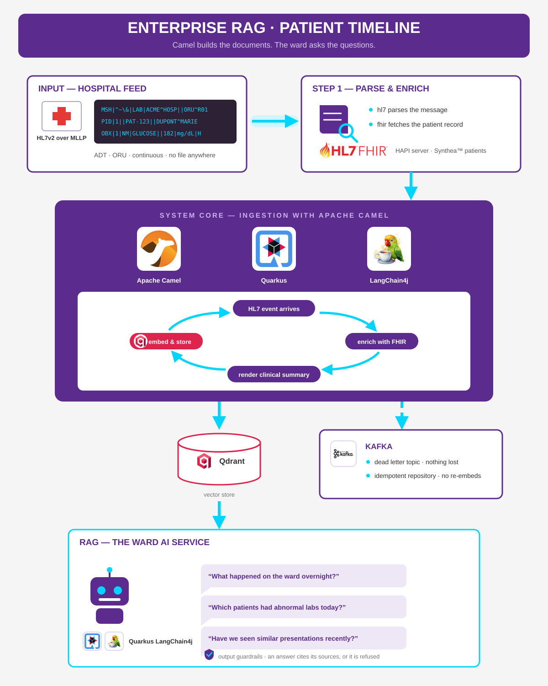

# langchain4j-enterprise-rag

Enterprise RAG, the integration way. Camel ingests a hospital's HL7v2 feed, enriches
it with FHIR, and keeps a Qdrant vector store in sync. A Quarkus LangChain4j AI
service answers ward questions, grounded and with citations.

Follow-up to [`langchain4j-ingest-rag`](https://github.com/apache/camel-quarkus-examples/pull/580),
built with [Quarkus](https://quarkus.io/).

## The problem

The intro example ingests a folder of Markdown files. That is a hello world.

Real company knowledge does not sit in folders. It moves through systems, in formats
only integration software can read. A hospital is the sharpest case: admissions and
lab results arrive as HL7v2 messages over MLLP, patient records live in a FHIR server.
A raw HL7v2 message looks like this:

```
MSH|^~\&|LAB|ACME^HOSP|EHR|ACME|20261002||ORU^R01|MSG0042|P|2.4
PID|1||PAT-123||DUPONT^MARIE||19560312|F
OBX|1|NM|2345-7^GLUCOSE^LN||182|mg/dL|70-99|H|||F
```

No AI stack can embed that and get anything useful back. There is no file to convert,
no document to load. The document has to be **built** from live systems, and rebuilt
every time they change. That is an integration problem. Camel's problem.

### HL7v2 for the rest of us

HL7v2 is a pipe-separated format from 1987 where column positions carry the meaning.
One line per segment, named by its first three letters; `^` splits a column into parts.

| Line | What it says |
|---|---|
| `MSH\|...\|LAB\|ACME^HOSP\|EHR\|...\|ORU^R01\|MSG0042\|...` | The envelope: the lab of ACME hospital tells the EHR "here is a lab result" (`ORU^R01`), message number MSG0042 |
| `PID\|1\|\|PAT-123\|\|DUPONT^MARIE\|\|19560312\|F` | The patient: id PAT-123, name Dupont Marie, born 1956-03-12, female |
| `OBX\|1\|NM\|2345-7^GLUCOSE^LN\|\|182\|mg/dL\|70-99\|H\|...` | One result: glucose (LOINC 2345-7) is 182 mg/dL, normal range 70-99, flagged `H` for high |

The whole message says: *the lab reports that Marie Dupont's glucose is 182, above
normal*. The same information as a FHIR R4 `Observation`, in one line instead of
twenty-five of JSON.

### And FHIR, in one paragraph

[FHIR](https://hl7.org/fhir/) (Fast Healthcare Interoperability Resources) is HL7's
modern standard: it breaks medical data down into small, reusable building blocks
called **resources**, such as `Patient`, `Observation`, `Condition` or
`MedicationRequest`, exchanged as JSON over a REST API. A patient's record is a graph
of resources referencing each other. Where HL7v2 is the wire format of the hospital's
event feeds, FHIR is the API of its records.

## The story

A hospital ward runs an assistant for its clinicians. The knowledge is the patients'
own data. All data is synthetic.

Hospitals run both worlds side by side, and will for years: the event feeds (labs,
admissions) speak HL7v2, the records and APIs speak FHIR. This example deliberately
keeps both, as they are. Converting the v2 feed to FHIR is possible (the official
V2-to-FHIR mapping, or flows like the
[`fhir/` example](https://github.com/apache/camel-quarkus-examples/tree/main/fhir),
which stores HL7v2 patients into a HAPI server), but that serves a different concern:
keeping the system of record up to date. Here the record already exists; we build
knowledge from both sources without converting either.

Two ingestion routes, two kinds of documents, one vector store:

| Route | Source | Document produced | Pace |
|---|---|---|---|
| `ward` | HL7v2 over MLLP, continuous | **Event summary**: "Glucose: 182 mg/dL, flagged HIGH", id `PAT-123@MSG0001` | Real time, as the feed beats |
| `records` | FHIR R4, read with the `fhir` component | **Record summary**: active conditions, medications, allergies of a patient, id `PAT-123@<lastUpdated>` | Initial load, once; then change tracking (see below) |

The two formats are never converted into each other. They converge on the same
target: plain text a model can embed. Retrieval mixes both document kinds naturally:
"which patients had abnormal labs?" matches events, "any patients on anticoagulants?"
matches records, and every answer cites the documents it stands on.

## Flow



## Ingestion: Camel builds the documents

**The `ward` route (events).** An HL7v2 message arrives on the MLLP port, the `hl7`
data format parses it, and a **mapping** renders one clinical summary per event: the
parsed message is encoded to HL7's standard XML form, and an XSLT shapes the document.
The mapping is configuration, not code: what the knowledge base says about an event is
adjusted in the stylesheet, without touching Java. The document id is version-aware
(`PAT-123@MSG0001`): the ingest engine is first-write-wins, every new event is a new
document. The vector store follows the ward in real time.

**The `records` route (context).** The initial load. Once the server is seeded, one
full scan (paged, like every FHIR search) renders one record summary per patient: who
they are, active conditions, current medications, allergies. The example deliberately
stops there; what follows in production is the next section.

### Keeping the records in sync (production)

Re-scanning a client's FHIR database on a schedule is not an option. In production the
full scan runs **once**; staying in sync afterwards is change tracking, and Camel
covers every variant of it:

- **Poll `_history` with a persisted cutoff.** One request asks the server for
  everything that changed since the last watermark; only the affected patients are
  re-read and re-rendered. A quiet server costs one request per poll. The details that
  matter: `_since` is inclusive (advance the watermark one tick past the newest
  change), the feed is paged (`fhir://load-page/next` walks the pages), and the
  watermark must survive restarts (a table, a topic, a file).
- **FHIR Subscriptions.** The server pushes each change to a rest-hook endpoint: a
  plain Camel HTTP route receives it, no polling at all. The push variant of the same
  flow, when the server supports it.
- **CDC on the record system's database.** When the FHIR API offers neither, Debezium
  (`camel-debezium`) streams the database's own change log.

Whichever the transport, the processing stays this example's pipeline: changed patient
in, fresh summary out, same version-aware document id; the deduplication absorbs
replays.

No file is read anywhere in the flow, and nothing is converted between HL7 and FHIR.

### From the wire to the vector store

What one event looks like at each end. In: a single MLLP frame, HL7v2 ER7.

```
MSH|^~\&|LAB|ACME^HOSP|EHR|ACME|20261002093000||ORU^R01|MSG0001|P|2.4
PID|1||PAT-123||Dupont^Marie||19560312|F
OBR|1|||24331-1^Metabolic panel^LN
OBX|1|NM|2345-7^Glucose^LN||182|mg/dL|70-99|H|||F
OBX|2|NM|2823-3^Potassium^LN||4.1|mmol/L|3.5-5.2||||F
```

Out: the document the embedding model actually sees, rendered by the mapping.

```
Patient Marie Dupont (id PAT-123, born 1956-03-12, sex F).
Event ORU^R01 at 20261002093000.
Lab results:
- Glucose: 182 mg/dL (reference 70-99), flagged HIGH
- Potassium: 4.1 mmol/L (reference 3.5-5.2)
```

Codes become words on the way through: `H` reads "flagged HIGH", `HH` reads
"flagged CRITICALLY HIGH", the reference range sits next to the value. That is the
point of the mapping: a question like "which patients had abnormal labs?" can only
match text that says abnormal things in plain language.

The `records` route does the same for the other world. In: FHIR R4 resources, as the
server returns them (excerpt; one `Condition` and one `MedicationRequest` out of a
patient's record):

```json
{ "resourceType": "Condition",
  "clinicalStatus": { "coding": [{ "code": "active" }] },
  "code": { "coding": [{ "system": "http://snomed.info/sct",
                         "code": "44054006", "display": "Type 2 diabetes mellitus" }] },
  "subject": { "reference": "Patient/PAT-123" },
  "recordedDate": "2019-03-18" }

{ "resourceType": "MedicationRequest", "status": "active",
  "medicationCodeableConcept": { "coding": [{ "system": "http://www.nlm.nih.gov/research/umls/rxnorm",
                                              "code": "860975", "display": "Metformin 500 MG" }] },
  "subject": { "reference": "Patient/PAT-123" } }
```

Out: one record summary per patient, written as one fact per sentence, every
sentence naming the patient.

```
Patient Marie Dupont (id PAT-123, born 1956-03-12, sex F).
Marie Dupont has Type 2 diabetes mellitus (since 2019).
Marie Dupont has Essential hypertension (since 2021).
Marie Dupont takes Metformin 500 MG.
Marie Dupont is allergic to Penicillin.
```

Same lesson on both routes: coded structure in (`44054006`, `860975`), words out
("type 2 diabetes", "metformin"). The display labels the standards carry are what
makes the documents readable.

The sentence form is not a style choice, it is retrieval engineering, and it was
measured: in a comma-separated list of fifteen conditions, the ward's one
congestive-heart-failure patient ranked 15th of 40 segments for "heart failure"
(the single mention drowns in the embedding of the long list); as its own sentence
the fact ranks first. And when the splitter cuts a long record into several
segments, a fragment of an anonymous list loses its patient, while each of these
sentences stays attributable on its own.

What Qdrant stores per document: the text split into segments, each with its
768-dimension embeddinggemma vector and this payload (a real one, straight from the
Qdrant console):

```json
{ "index": "0",
  "text_segment": "Patient Paul Martin (id PAT-456, born 1970-11-20, sex M).\nEvent ADT^A01 at 20261003080000.\nAdmitted to CARD1, reason: Chest pain.",
  "camel_ingest_pipeline": "ward",
  "camel_ingest_document_id": "PAT-456@DEMO1" }
```

`camel_ingest_pipeline` says which route produced the document, `camel_ingest_document_id`
is the version-aware citation, `index` numbers the segments of a split document.

**Cross-cutting, the parts a hospital would actually require:**

- A **dead-letter channel** on the feed, backed by a Kafka topic. The ingest
  extension has none in this increment: a failed record is logged and dropped.
  A silently lost lab result is not acceptable. The Camel route in front parks
  every failed message on the dead letter topic: retry, audit, alert.
- A **Kafka idempotent repository** (`KafkaIdempotentRepository`, camel-kafka).
  The default register is in-memory: every restart re-embeds everything. With
  Kafka it survives restarts, and one broker covers both safety concerns.
- Every summary carries metadata: `patient`, `ward`, `event-type`. Retrieval filters
  on it, answers cite their source through `camel_ingest_document_id`.

## RAG: plain Quarkus LangChain4j

Deliberately standard. The point of the example is that the ingestion is where the
work was.

- Vector store: Qdrant, through `quarkus-langchain4j-qdrant` and its Dev Service.
- Embeddings: embeddinggemma (768 dimensions) served by the same local Ollama as
  the chat model, shared by ingestion and retrieval. No API key. It replaced the
  in-process ONNX models (all-MiniLM-L6-v2, then bge-small-en-v1.5): measured on
  this corpus, only embeddinggemma ranks the expected patient first on every demo
  question; the small 384-dimension models drown a single mention ("chronic
  congestive heart failure") in a long condition list.
- Chat model: Ollama, as in the intro example.
- The ward AI service: `@RegisterAiService` with a `RetrievalAugmentor` supporting a
  metadata filter (one patient, one ward). An AI service, not an agent: one grounded
  question-answer flow, no tools, no multi-agent loop.
- **Output guardrails** against hallucination: an answer must be grounded in the
  retrieved segments and cite its sources (`camel_ingest_document_id`), or it is
  refused. Quarkus LangChain4j's guardrail API, used as designed.

**The right questions.** Retrieval-augmented answers are for what a structured query
cannot do: cross-document, temporal and similarity questions.

- "What happened on the ward overnight?"
- "Which patients had abnormal labs today?"
- "Have we seen similar presentations recently?"

A single-patient factual lookup ("is this patient on anticoagulants?") stays a FHIR
query: deterministic, no model in the path. The record summaries make the assistant
aware of that context, they do not replace the system of record. The demo script
below lists the questions to ask, with the answers to expect.

## The dataset: Synthea™, generated by us

All patient data is synthetic, produced with [Synthea™](https://github.com/synthetichealth/synthea),
MITRE's Synthetic Patient Population Simulator. Synthea™ is Java and Apache-2.0
licensed, the same license as Camel, so provenance is clean for an ASF repo (the
pre-generated `synthea-sample-data` zips carry no license file, so we do not copy them).

- `src/main/resources/data/synthea/` holds 20 patients as **FHIR R4 transaction
  bundles** in JSON. Every entry carries a POST request, so seeding the HAPI FHIR
  server is a plain POST of each file to the server root: the server creates the
  resources and resolves the references between them. No transformation needed.
- These files are **not** ingested into the vector store. They only bootstrap the
  demo's FHIR server, the "live system" the example talks to. The knowledge flows
  in through the HL7v2 feed and the FHIR queries, never from files.
- The dataset is reproducible: fixed seeds, fixed reference date, pinned Synthea™
  version. Regenerate or extend it with:

  ```shell script
  jbang GenerateDataset.java
  ```

  The script downloads the pinned Synthea™ release once (~200 MB, into `target/`),
  keeps only living patients, and slims each bundle to the resources the example
  uses: Patient, Encounter, Condition, MedicationRequest, AllergyIntolerance,
  Immunization (~2 MB in total instead of tens of MB).
- The HL7v2 messages are **not** taken from the internet: sample messages found online
  reference patients that do not exist in our FHIR server, and the knowledge base
  should tell one coherent story per patient across both routes. The feeder (phase 4)
  builds valid ADT and ORU messages with HAPI (the library the `hl7` component already
  uses), using the ids of the seeded Synthea™ patients. Same ids on both sides,
  plausible lab values, a coherent flow.

## Running it: real systems, no stand-ins

The example runs against the real thing:

- **Ollama** on the developer's machine, with the chat and embedding models pulled
  once:

  ```shell script
  ollama pull gemma4:e4b
  ollama pull embeddinggemma:300m
  ```

- **HAPI FHIR server** as a [Compose Dev Service](https://quarkus.io/guides/compose-dev-services)
  (`compose-devservices.yml`): Quarkus starts the container in dev and test mode,
  the same image the `fhir/` example uses. A one-shot bootstrap route
  (`timer?repeatCount=1`) waits for the server, seeds it with the Synthea™ bundles,
  then runs the `records` route's initial load.
  Seeding is idempotent: a server that already holds patients is left alone. The
  hospital and practitioner bundles load first; the patient bundles reference them
  by conditional URL, so the order matters.
- **Qdrant** started by its Dev Service, collection pre-created. **Kafka** joins in
  phase 3.
- **A feeder** sends the generated HL7v2 messages to the MLLP port (phase 4), so the
  demo has a live pulse without typing. Until then, the demo page does the job.

Start dev mode from this directory:

```shell script
./mvnw quarkus:dev
```

> **_NOTE:_** Quarkus ships with a Dev UI, available in dev mode only at
> <http://localhost:8080/q/dev/>.

Two Compose Dev Services tricks worth noting:

- The HAPI image is distroless: no shell, no curl, so no compose `healthcheck` can
  run inside it. The `io.quarkus.devservices.compose.wait_for.logs` label makes
  Quarkus watch the container **logs** instead, and hold the application start until
  HAPI reports ready. No polling noise, no hand-rolled wait loop around the routes.
- `quarkus.compose.devservices.reuse-project-for-tests=true` lets the tests reuse
  the FHIR server already started by dev mode. Without it, the tests start an
  isolated copy of the compose project, which cannot bind the fixed port while dev
  mode runs.

WireMock appears **only** in the JVM and native tests, standing in for Ollama so CI
runs without a GPU (the `OllamaTestResource` pattern from the intro example): chat
answers are canned, and `/api/embed` returns deterministic bag-of-words vectors, so
retrieval keeps real ranking semantics without any model. The MLLP feed is plain TCP
and is fed directly from the tests; FHIR is the same Compose Dev Service there too.

### The demo page

`GET /` serves one page (Qute template, WebSockets Next underneath):

- **Live**: every document as it is ingested, record summaries and event summaries
  alike. On a fresh start, the 20 patient records land right after the seeding.
- **Feed**: paste an HL7v2 message. `POST /feed` sends it through the real MLLP wire
  with Camel's own `mllp` producer, and the acknowledgment comes back once the
  ingestion completed. No shortcut into the route.
- **Chat**: the ward AI service, grounded answers only.

### The demo script

Open <http://localhost:8080>. Quarkus starts HAPI FHIR and Qdrant, seeds the 20
Synthea™ patients, and the record summaries land in the **Live** panel. Then send
the three presets from the **Feed** box: an admission, an abnormal lab result and a
normal one, timestamped in the recent past of your clock.

Questions about the records (available right after startup):

| Question | Expected answer |
|---|---|
| Do we have any patients with heart failure? | Shalanda Gislason (chronic congestive heart failure) |
| Any patients with chronic kidney disease? | Wilfredo Fritsch (CKD stages 1 to 3) |
| Which patients are on clopidogrel or other antiplatelets? | Six patients take clopidogrel (Mauro Braun, Rosario Ortiz, Cristobal Montero, Rubin Lakin, Larissa Osinski, Ronny O'Hara), Rosario Ortiz also aspirin; expect four or five of them, see the note below |
| Who had coronary bypass surgery? | Larissa Osinski, Ronny O'Hara, Mauro Braun, Rubin Lakin |
| Which patients have epilepsy? | Cristobal Montero, Kera King |

> **_NOTE:_** retrieval fetches the 16 closest facts, it is not a `SELECT *`. When
> many patients share a treatment, the answer names the ones retrieval surfaced and
> may miss a couple: grounded, correct, but not exhaustive. An exhaustive roster
> ("all patients on clopidogrel") is a structured FHIR query, not a RAG question;
> the same boundary the RAG section above draws for the single-patient lookup.

Questions about the events (after sending the presets):

| Question | Expected answer |
|---|---|
| What happened on the ward today? | The three injected events (the presets are timestamped in the recent past, so "this morning" only matches if you demo in the morning) |
| Which patients had abnormal lab results? | Marie Dupont (glucose HIGH, potassium CRITICALLY HIGH) |
| Which patient has critically high potassium? | Marie Dupont |
| Why was Paul Martin admitted? | Chest pain, ward CARD1 |

And the raw retrieval: `GET /search?q=abnormal+glucose` shows the closest segments
with score and source document id: the pipeline, before the model touches anything.

> **_NOTE:_** until the Kafka idempotent repository arrives (phase 3), the
> deduplication register is in-memory while Qdrant keeps its data across live
> reloads: a code change in dev mode re-ingests the 20 records as duplicates.
> After editing code, do a full restart (`q`, then `./mvnw quarkus:dev` again)
> so the vector store starts clean.

## Endpoints

| Endpoint | Shows |
|---|---|
| `GET /` | The demo page: live documents, HL7v2 feed box, chat |
| `POST /feed` | Injects an HL7v2 message through the real MLLP wire, returns the ACK |
| `GET /search?q=` | Raw retrieval: the closest segments, score and source document id |
| `/ws/ward`, `/ws/chat` | The WebSockets behind the page: documents as they land, the grounded chat |

The patient filter on `/search` and a `GET /chat/preview?q=` prompt preview come with
phase 3 (metadata filtering and citations).

## Phasing

1. ~~Scaffold, Qdrant, assistant, the MLLP route with HL7 parsing, the XSLT summary
   mapping, with route tests and an end-to-end test.~~ **Done.**
2. ~~The `records` route: HAPI FHIR container, Synthea™ seeding at startup, the `fhir`
   polling consumer, record summaries.~~ **Done**, plus the live demo page (Qute,
   WebSockets Next, the real MLLP wire).
3. Kafka: dead letter topic, idempotent repository, metadata filtering, citations,
   output guardrails.
4. The feeder, README.adoc with the flow diagram, `examples.json` entry, native
   build, polish.

Each phase leaves the example buildable and demoable.

## Open questions

- Streaming chat? The intro example is synchronous. Streaming reads more like a real
  product but complicates the test setup.
- Where this lives in the end: drafted in `camel-ai-samples` for now; later
  `camel-quarkus-examples` or a dedicated blueprint repo.

## Packaging and running the application

The application can be packaged using:

```shell script
./mvnw package
```

It produces the `quarkus-run.jar` file in the `target/quarkus-app/` directory.
Be aware that it’s not an _über-jar_ as the dependencies are copied into the `target/quarkus-app/lib/` directory.

The application is now runnable using `java -jar target/quarkus-app/quarkus-run.jar`.

If you want to build an _über-jar_, execute the following command:

```shell script
./mvnw package -Dquarkus.package.jar.type=uber-jar
```

The application, packaged as an _über-jar_, is now runnable using `java -jar target/*-runner.jar`.

## Creating a native executable

You can create a native executable using:

```shell script
./mvnw package -Dnative
```

Or, if you don't have GraalVM installed, you can run the native executable build in a container using:

```shell script
./mvnw package -Dnative -Dquarkus.native.container-build=true
```

You can then execute your native executable with: `./target/langchain4j-enterprise-rag-1.0.0-SNAPSHOT-runner`

If you want to learn more about building native executables, please consult <https://quarkus.io/guides/maven-tooling>.

## Related Guides

- REST Jackson ([guide](https://quarkus.io/guides/rest#json-serialisation)): Jackson serialization support for Quarkus REST. This extension is not compatible with the quarkus-resteasy extension, or any of the extensions that depend on it
- Camel FHIR ([guide](https://camel.apache.org/camel-quarkus/latest/reference/extensions/fhir.html)): Exchange information in the healthcare domain using the FHIR (Fast Healthcare Interoperability Resources) standard
- Camel HL7 ([guide](https://camel.apache.org/camel-quarkus/latest/reference/extensions/hl7.html)): Marshal and unmarshal HL7 (Health Care) model objects using the HL7 MLLP codec
- Camel MLLP ([guide](https://camel.apache.org/camel-quarkus/latest/reference/extensions/mllp.html)): Communicate with external systems using the MLLP protocol
- Camel LangChain4j Ingest ([guide](https://camel.apache.org/camel-quarkus/latest/reference/extensions/langchain4j-ingest.html)): Declarative AI document ingestion: point a knowledge base at a folder via configuration; splitting, embedding and storing are handled under the hood
- LangChain4j Qdrant embedding store ([guide](https://docs.quarkiverse.io/quarkus-langchain4j/dev/index.html)): Provides the Qdrant Embedding store for LangChain4j
- LangChain4j Ollama ([guide](https://docs.quarkiverse.io/quarkus-langchain4j/dev/guide-ollama.html)): Provides the basic integration of Ollama with LangChain4j
